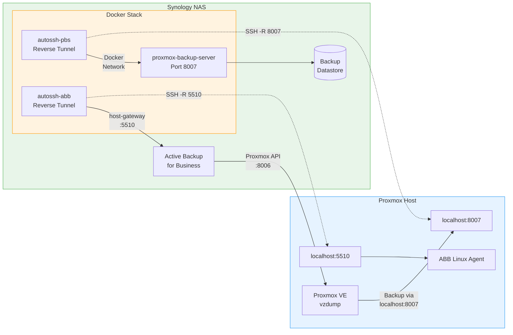

# IceBackup - Proxmox Backup Strategy: PBS + ABB on Synology

A two-tier backup strategy for Proxmox VE hosts using Proxmox Backup Server (PBS) as a Docker container on a Synology NAS, combined with Synology Active Backup for Business (ABB).



## Overview

| Tier | Method | Frequency | Purpose |
|------|--------|-----------|---------|
| **Tier 2** | PBS (incremental, deduplication) | Daily 01:00 | Fast VM-level backup with dedup |
| **Tier 3** | ABB (Active Backup for Business) | Weekly Sun 05:00 | Independent second copy + bare-metal |

**Network challenge**: The Synology can reach the Proxmox host, but **not vice versa**. Since PBS normally works in push mode (Proxmox pushes to PBS), a **reverse SSH tunnel** from Synology to Proxmox is established, so Proxmox can reach PBS via `localhost:8007`.

## Documentation

- [Setup Guide](docs/01-setup.md) - Complete installation from scratch
- [Daily Operations](docs/02-operations.md) - Start, stop, monitor, manual backups
- [VM Restore](docs/03-restore-vm.md) - Restore individual VMs from PBS
- [Bare-Metal Restore](docs/04-restore-baremetal.md) - Full host recovery
- [ABB Integration](docs/05-abb-integration.md) - Active Backup for Business setup
- [Best Practices](docs/06-best-practices.md) - Retention, verification, secondary destinations
- [Troubleshooting](docs/07-troubleshooting.md) - Common issues and fixes
- [docker-compose.yml Reference](docs/08-docker-compose-reference.md) - Annotated compose file

## Quick Start

```bash
# 1. Clone and configure
git clone https://github.com/icepaule/IceBackup.git
cd IceBackup

# 2. Follow the setup guide
# See docs/01-setup.md for complete instructions
```

## Requirements

- Synology NAS with DSM 7.2+
- Docker (Synology Container Manager)
- Proxmox VE 7.x or 8.x
- Active Backup for Business (free Synology package)
- SSH access between Synology and Proxmox host

## Stack

| Component | Image | Purpose |
|-----------|-------|---------|
| PBS | `ayufan/proxmox-backup-server` | Proxmox Backup Server |
| autossh-pbs | `jnovack/autossh` | Reverse tunnel for PBS (port 8007) |
| autossh-abb | `jnovack/autossh` | Reverse tunnel for ABB agent (port 5510) |

## License

MIT
