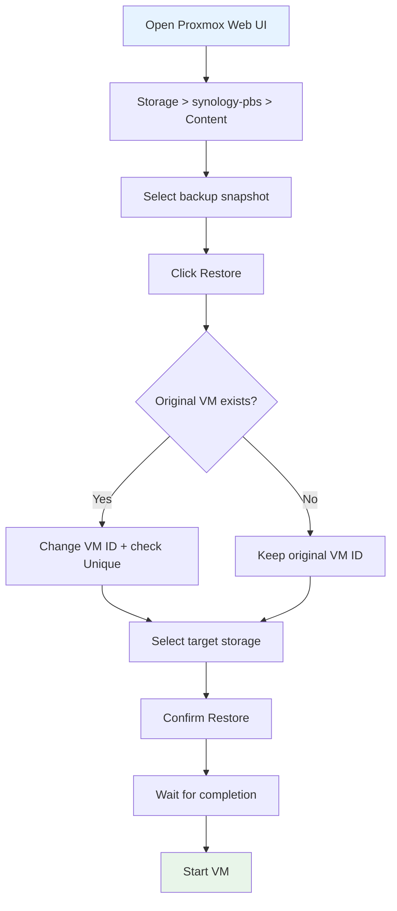

# Restore Individual VMs

## Option A: Restore via Proxmox Web UI (Recommended)

1. Open Proxmox Web UI: `https://<PROXMOX_HOST>:8006`
2. Navigate to **Storage** > `synology-pbs` > **Content**
3. Select the desired backup (VM ID, date)
4. Click **Restore**
5. Configure options:
   - **Target Storage**: Destination storage for VM disks
   - **VM ID**: Can be changed (e.g., if original still exists)
   - **Unique**: Check to generate new MAC addresses
   - **Start after restore**: Optional
6. Confirm **Restore**



## Option B: Restore via Proxmox CLI

```bash
# List available backups
pvesh get /nodes/<NODE>/storage/synology-pbs/content --content backup

# Restore a VM (example: VM 101)
qmrestore pbs:backup/vm/101/<TIMESTAMP> 101

# Restore VM with a new ID
qmrestore pbs:backup/vm/101/<TIMESTAMP> 199 --unique true

# Restore LXC container
pct restore 102 pbs:backup/ct/102/<TIMESTAMP>

# Restore to specific storage
qmrestore pbs:backup/vm/101/<TIMESTAMP> 101 --storage local-lvm
```

### Timestamp format

PBS backup timestamps follow the format: `YYYY-MM-DDTHH:MM:SSZ`

Example: `2026-02-25T06:32:20Z`

## Option C: Extract Individual Files

### Via PBS Web UI

1. Open PBS Web UI: `https://<SYNOLOGY_IP>:8007`
2. Navigate to Datastore > `vm-backups`
3. Select a snapshot
4. Use **File Restore** to browse and download individual files

### Via CLI

```bash
# Dump file catalog from a snapshot
docker exec -it proxmox-backup-server \
  proxmox-backup-client catalog dump \
  backup-client@localhost:vm-backups \
  --snapshot vm/101/<TIMESTAMP>
```

## Recovery Time Expectations

| VM Size | Estimated Restore Time |
|---------|----------------------|
| < 50 GB | 10-30 minutes |
| 50-200 GB | 30-90 minutes |
| 200+ GB | 1-4 hours |

*Times depend on network speed, storage I/O, and deduplication ratio.*
