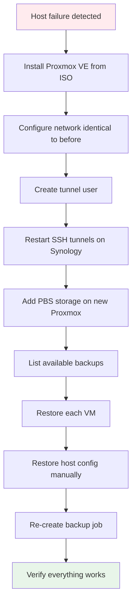

# Bare-Metal Restore of Proxmox Host

A complete bare-metal restore requires multiple steps because PBS backs up VMs,
not the host operating system itself. The host must be reinstalled first, then
VMs are restored from PBS.



## Scenario: Proxmox Host is Completely Down

### Step 1: Reinstall Proxmox VE

1. Download Proxmox VE ISO: https://www.proxmox.com/en/downloads
2. Create bootable USB stick (e.g., Rufus/Etcher)
3. Install Proxmox VE on the server
   - Use the **same network configuration** as before:
     - Same hostname
     - Same IP address / gateway / DNS
   - Configure storage as needed

### Step 2: Recreate Tunnel User

```bash
useradd -m -s /usr/sbin/nologin tunnel-synology
mkdir -p /home/tunnel-synology/.ssh

cat > /home/tunnel-synology/.ssh/authorized_keys << 'EOF'
no-pty,permitlisten="8007",permitlisten="5510",command="/bin/false" <PASTE_PUBLIC_KEY_HERE>
EOF

chown -R tunnel-synology:tunnel-synology /home/tunnel-synology/.ssh
chmod 700 /home/tunnel-synology/.ssh
chmod 600 /home/tunnel-synology/.ssh/authorized_keys
```

> **Important**: The public key is stored in the SSH keys directory on the Synology.
> Read it from `<docker-dir>/proxmox-backup/ssh-keys/id_tunnel.pub`.

### Step 3: Update Known Hosts & Restart Tunnels (Synology)

The new Proxmox installation will have a different host key:

```bash
# Regenerate known_hosts on Synology
ssh -o StrictHostKeyChecking=no -o BatchMode=yes <PROXMOX_HOST> echo 2>&1
grep <PROXMOX_HOST> ~/.ssh/known_hosts > /path/to/docker/proxmox-backup/ssh-keys/known_hosts

# Restart tunnels
cd /path/to/docker/proxmox-backup
docker compose restart autossh-pbs
docker logs autossh-pbs --tail 5   # Verify tunnel is up
```

### Step 4: Re-add PBS Storage (Proxmox)

```bash
pvesm add pbs synology-pbs \
  --server 127.0.0.1 --port 8007 \
  --datastore vm-backups \
  --username backup-client@pbs \
  --fingerprint "<PBS_FINGERPRINT>" \
  --password <PASSWORD>
```

> **Tip**: Get the fingerprint from Synology:
> `docker exec proxmox-backup-server proxmox-backup-manager cert info | grep Fingerprint`

### Step 5: Restore All VMs

```bash
# List available backups
pvesh get /nodes/<NODE>/storage/synology-pbs/content --content backup

# Restore each VM individually
qmrestore pbs:backup/vm/101/<TIMESTAMP> 101
qmrestore pbs:backup/vm/102/<TIMESTAMP> 102
# ... repeat for each VM

# Restore LXC containers
pct restore 103 pbs:backup/ct/103/<TIMESTAMP>
```

### Step 6: Restore Proxmox Host Configuration

These configurations must be restored **manually** (they are NOT in PBS backups):

| Configuration | Path | Notes |
|--------------|------|-------|
| Network bridges | `/etc/network/interfaces` | Critical for VM networking |
| Storage config | `/etc/pve/storage.cfg` | Auto-generated when adding storage |
| Firewall rules | `/etc/pve/firewall/` | Host and VM firewall rules |
| Cluster config | `/etc/pve/corosync.conf` | Only if clustered |
| Cron jobs | `/etc/cron.d/`, `/var/spool/cron/` | Custom scheduled tasks |
| Additional packages | - | e.g., ifupdown2, openvswitch |

> **Good news**: VM configuration files (`qemu-server.conf`) are automatically
> backed up by PBS and restored with the VM.

### Step 7: Re-create Backup Job

See [Setup Guide, Step 8](01-setup.md#step-8-create-backup-job-on-proxmox).

---

## Alternative: Bare-Metal Restore via ABB

If the ABB Linux Agent was installed on the Proxmox host (see [ABB Integration](05-abb-integration.md)),
a true bare-metal restore is possible:

1. Create recovery media in DSM (Active Backup > Physical Server > Tools)
2. Boot server from recovery media
3. Connect to Synology NAS
4. Select recovery point
5. Restore to disk

> **Note**: The recovery media requires **direct network access** to the Synology.
> The reverse tunnel is not available during bare-metal recovery.
> Ensure temporary direct connectivity (VPN, port forwarding, etc.).

## Disaster Recovery Checklist

- [ ] Proxmox VE ISO available (USB stick or download)
- [ ] SSH public key accessible (on Synology under `ssh-keys/id_tunnel.pub`)
- [ ] PBS fingerprint documented
- [ ] PBS `backup-client@pbs` password documented
- [ ] Network configuration documented (IP, gateway, DNS, bridges)
- [ ] List of VMs/CTs and their IDs documented
- [ ] ABB recovery media created and tested (if using ABB)
