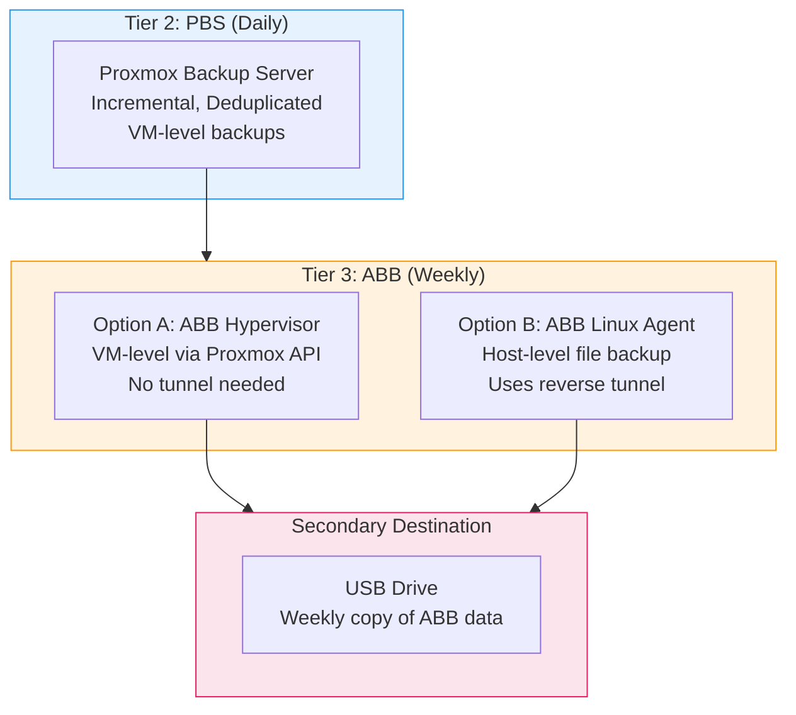

# ABB Integration (Active Backup for Business)

ABB complements PBS as a Tier-3 backup with two options:



## Option A: ABB Hypervisor Backup (Recommended)

Backs up all VMs at the hypervisor level directly via the Proxmox API.
**No tunnel needed** - ABB runs on the Synology and can reach Proxmox directly.

### Setup in DSM

1. Open **DSM** > **Active Backup for Business** > **Virtual Machine**
2. **Manage** > **Add Hypervisor**
3. Settings:
   - **Type**: Proxmox VE
   - **Server address**: `<PROXMOX_HOST>`
   - **Port**: `8006`
   - **Account**: `root@pam` (or dedicated ABB user with PVEAuditor+PVEVMAdmin role)
   - **Password**: Proxmox root password
   - **Verify SSL certificate**: Disable (self-signed certificate)
4. **Select VMs**: Mark all VMs
5. **Task settings**:
   - **Schedule**: Weekly, Sunday 05:00
   - **Retention**: GFS - 4 weekly, 3 monthly
   - **Transfer encryption**: Enabled (AES-256)
   - **Compression**: Enabled
   - **Application-consistent backup**: Enable (requires QEMU Guest Agent)
   - **Verification**: Enable, 120 min after backup
   - **Notifications**: Enable
6. **Apply**

### Restore via ABB

1. **DSM** > **Active Backup for Business** > **Virtual Machine**
2. **Restore** > Select VM and version
3. Options:
   - **Restore to original hypervisor**: Restores VM directly to Proxmox
   - **Download as files**: Exports VM image

## Option B: ABB Linux Agent on Proxmox (Host-Level)

Backs up the Proxmox host itself (operating system, configuration, etc.).
Uses the reverse tunnel via port 5510.

### Setup

#### 1. Install ABB Linux Agent on Proxmox

```bash
# On Proxmox as root:
# Download agent from Synology
wget "https://<SYNOLOGY_IP>:5001/webapi/entry.cgi?api=SYNO.ActiveBackup.Servlet&method=download_client&version=1" \
  -O ABBAgent.deb --no-check-certificate

# Or: Download agent from DSM manually:
# DSM > Active Backup for Business > Linux > Download Agent

dpkg -i ABBAgent.deb
```

#### 2. Register Agent with Synology (via Reverse Tunnel)

Since Proxmox cannot directly reach the Synology, the agent uses the tunnel:

```bash
# The reverse tunnel makes port 5510 available on localhost
abb-cli -c register -s 127.0.0.1 -p 5510 -u <DSM_USERNAME> -w <DSM_PASSWORD>
```

#### 3. Configure Backup Task in DSM

1. **DSM** > **Active Backup for Business** > **Physical Server**
2. The Proxmox host should appear after registration
3. **Create task**:
   - **Backup type**: Entire device (recommended) or specific volumes
   - **Schedule**: Weekly, Sunday 05:00
   - **Retention**: GFS - 4 weekly, 3 monthly
   - **Compression**: Enabled
   - **Verification**: Enabled
   - **Notifications**: Enabled
4. **Apply**

#### 4. Bare-Metal Restore with ABB

1. **DSM** > **Active Backup for Business** > **Physical Server** > **Restore**
2. **Create recovery media**:
   - DSM > Active Backup for Business > Physical Server > Tools > Create Recovery Media
   - Create USB stick or ISO
3. **Boot server from recovery media**
4. **Connect to Synology**:
   - Enter Synology IP or hostname
   - Enter DSM credentials
5. **Select recovery point**
6. **Select target disk(s)**
7. **Start restore**

> **Important**: For bare-metal restore, direct network access to the Synology is required.
> The recovery media cannot use the reverse tunnel. Ensure temporary direct connectivity
> (VPN, port forwarding, physical network access, etc.).

## Comparison: Option A vs Option B

| Feature | Option A (Hypervisor) | Option B (Linux Agent) |
|---------|----------------------|----------------------|
| What's backed up | VMs only | Host OS + config |
| Tunnel needed | No | Yes (port 5510) |
| Bare-metal restore | No (VMs only) | Yes |
| Backup granularity | VM-level | File-level |
| QEMU Guest Agent needed | Recommended | No |
| Recovery speed | Fast (direct VM restore) | Slow (full disk restore) |

**Recommendation**: Use **both options** for maximum protection:
- Option A for quick VM restores
- Option B for host-level disaster recovery
