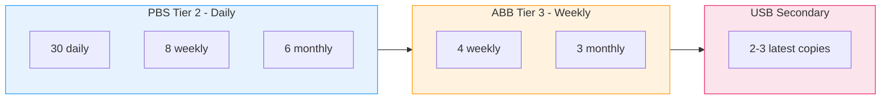

# Best Practices

## Retention Strategy

### Recommended Retention by Tier



| Tier | Keep Daily | Keep Weekly | Keep Monthly | Prune Schedule |
|------|-----------|-------------|--------------|----------------|
| PBS (Tier 2) | 30 | 8 | 6 | Daily 03:00 |
| ABB VM (Tier 3) | - | 4 | 3 | After backup |
| ABB Server | 7 | 4 | 3 | After backup |
| USB (Secondary) | - | - | 2-3 copies | Weekly Sun 08:00 |

### Why Not Just 2 Versions?

- **Ransomware**: Encryption may not be noticed for days/weeks. With only 2 versions, both may be corrupted.
- **Silent data corruption**: Bit rot or application bugs may corrupt data gradually.
- **Accidental deletion**: Users may not notice deleted files for weeks.
- **Compliance**: Many regulations require 30+ days of backup history.

## Backup Verification

**Always enable backup verification** in both PBS and ABB.

### PBS Verification

```bash
# Enable auto-verify for new backups
docker exec proxmox-backup-server \
  proxmox-backup-manager datastore update vm-backups --verify-new true
```

### ABB Verification

In each ABB task settings:
- Enable **Backup verification**
- Set delay: 120 minutes after backup completion
- This performs checksum validation of the backup data

## Secondary Destination (USB)

### Setup in DSM

1. **DSM** > **Active Backup for Business** > **Settings** > **Secondary Destination**
2. **Add destination**:
   - **Target**: USB drive (select mounted USB volume)
   - **Schedule**: Weekly, Sunday 08:00 (after all backups complete)
   - **Tasks**: Include all backup tasks
3. **Apply**

### USB Drive Sizing

Estimate required space:

| Source | Typical Size (with dedup) |
|--------|--------------------------|
| PBS VM backups | 200-500 GB |
| ABB Server backups | 50-100 GB each |
| ABB VM backups | 100-300 GB |
| **Total** | **350-900 GB minimum** |

> **Recommendation**: Use a dedicated USB drive with at least 2 TB for secondary destination.
> Do not mix backup data with other files on the same drive.

### USB Drive Health

- Monitor USB drive health via DSM > Storage Manager
- Replace USB drives every 3-5 years
- Consider rotating multiple USB drives (A/B rotation)

## Scheduling Best Practices

Stagger backup times to avoid resource contention:

```
01:00  PBS daily backup (Proxmox -> PBS via tunnel)
03:00  PBS prune job (cleanup old snapshots)
04:00  PBS garbage collection (Saturday only)
05:00  ABB weekly backup (Sunday, Synology -> Proxmox API)
08:00  ABB secondary destination copy (Sunday, to USB)
```

## Security Best Practices

### Tunnel User Restrictions

The SSH tunnel user should be **severely restricted**:

```
no-pty,permitlisten="8007",permitlisten="5510",command="/bin/false"
```

This ensures:
- No interactive shell access
- Only port forwarding on ports 8007 and 5510
- No command execution

### PBS User Separation

- **root@pam**: Admin access to PBS web UI only
- **backup-client@pbs**: Used by Proxmox for backups (DatastoreBackup role only)
- Never use root for automated backup tasks

### Network Security

- PBS listens on port 8007 with TLS (self-signed certificate)
- SSH tunnel uses ed25519 keys (strongest available)
- ServerAliveInterval ensures dead connections are detected within 30 seconds
- ExitOnForwardFailure prevents silent tunnel failures

## Monitoring Checklist

Regularly verify:

- [ ] All 3 Docker containers are running (`docker compose ps`)
- [ ] SSH tunnels are connected (check autossh logs)
- [ ] Daily PBS backups complete successfully (Proxmox task log)
- [ ] Weekly ABB backups complete successfully (DSM notifications)
- [ ] Prune jobs run on schedule (PBS task log)
- [ ] Garbage collection runs weekly (PBS task log)
- [ ] USB secondary destination copies succeed (DSM notifications)
- [ ] Storage usage is within acceptable limits (`df -h`)
- [ ] No backup verification failures
