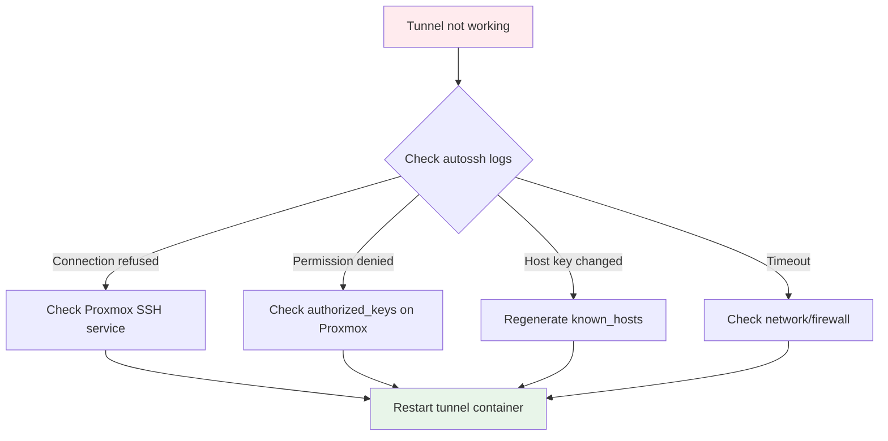
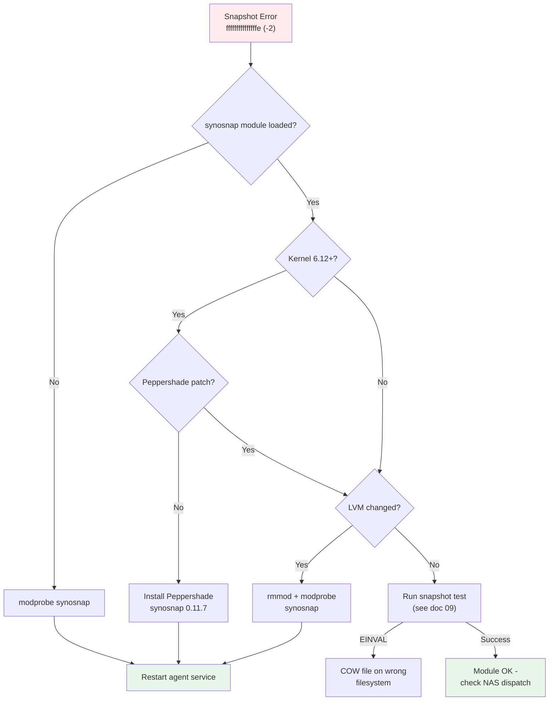

# Troubleshooting

## Tunnel is Down



```bash
# Check tunnel logs
docker logs autossh-pbs --tail 20
docker logs autossh-abb --tail 20

# Test SSH connection manually (from Synology)
ssh -i /path/to/ssh-keys/id_tunnel \
  -o UserKnownHostsFile=/path/to/ssh-keys/known_hosts \
  tunnel-synology@<PROXMOX_HOST>

# Restart tunnel containers
docker compose restart autossh-pbs autossh-abb
```

## PBS Not Reachable

```bash
# Check container status
docker compose ps

# Test PBS directly (from Synology)
curl -k https://localhost:8007/api2/json/version

# Test via tunnel (from Proxmox)
curl -k https://127.0.0.1:8007/api2/json/version
```

If PBS container keeps restarting:
```bash
# Check PBS logs for startup errors
docker logs proxmox-backup-server --tail 100

# Common issues:
# - tmpfs not mounted (kernel 4.4 requirement)
# - Permission issues on data directories
# - Port 8007 already in use
```

## Backup Fails

```bash
# Check PBS logs
docker logs proxmox-backup-server --tail 50

# On Proxmox: check task log
cat /var/log/vzdump/*.log

# Check disk space
df -h /path/to/backup/pbs-datastore/

# Check datastore status
docker exec proxmox-backup-server \
  proxmox-backup-manager datastore show vm-backups
```

### Common Backup Errors

| Error | Cause | Solution |
|-------|-------|----------|
| `connection refused` | Tunnel down | Restart autossh-pbs |
| `authentication failed` | Wrong password/fingerprint | Re-add storage with correct credentials |
| `datastore full` | No space left | Run prune + GC, or add storage |
| `snapshot failed` | VM agent not responding | Check QEMU Guest Agent |
| `timeout` | Network too slow | Increase timeout, check bandwidth |

## PBS Web UI Not Accessible

- URL must use **HTTPS**: `https://<SYNOLOGY_IP>:8007`
- Browser warning about self-signed certificate is **normal** - accept it
- Login: `root@pam` with realm **"Linux PAM standard authentication"**
- If login fails, reset password:
  ```bash
  docker exec proxmox-backup-server \
    proxmox-backup-manager user update root@pam --password <NEW_PASSWORD>
  ```

## Host Key Changed (After Proxmox Reinstall)

```bash
# On Synology: regenerate known_hosts
ssh -o StrictHostKeyChecking=no -o BatchMode=yes <PROXMOX_HOST> echo 2>&1
grep <PROXMOX_HOST> ~/.ssh/known_hosts > /path/to/ssh-keys/known_hosts

# Restart tunnels
docker compose restart autossh-pbs autossh-abb
```

## ABB Agent Registration Fails

```bash
# On Proxmox: check if tunnel port 5510 is listening
ss -tlnp | grep 5510

# If not listening, check autossh-abb container
docker logs autossh-abb --tail 20

# Try registration with verbose output
abb-cli -c register -s 127.0.0.1 -p 5510 -u <DSM_USER> -w <DSM_PASS>
```

## ABB Snapshot Errors



If ABB reports "Failed to take a snapshot" (Error Code: fffffffffffffffe):

1. **Check filesystem type**: ABB snapshots require LVM, btrfs, or ext4 with sufficient space
2. **Check available space**: Snapshots need free space in the volume group
3. **Check synosnap module**: Must be loaded and compatible with the running kernel

```bash
# On the affected host, check filesystem and module
lsblk -f
df -h
lvs  # Check LVM status
lsmod | grep synosnap
cat /proc/synosnap-info
```

### Kernel 6.12+ (synosnap Build Failure)

The stock synosnap module (dattobd-based) does **not compile on kernel 6.12+** due to block layer API changes. DKMS build fails with:

```
error: implicit declaration of function 'blkdev_get_by_path'
error: 'struct bio' has no member named 'bi_disk'
```

**Fix**: Install the [Peppershade synosnap fork](https://github.com/Peppershade/synosnap):

```bash
sudo dkms remove synosnap/0.11.6 --all 2>/dev/null
cd /usr/src && sudo git clone https://github.com/Peppershade/synosnap.git synosnap-0.11.7
sudo dkms add synosnap/0.11.7
sudo dkms build synosnap/0.11.7
sudo dkms install synosnap/0.11.7
sudo rmmod synosnap 2>/dev/null; sudo modprobe synosnap
```

See [Linux Agent Setup](09-linux-agent-bare-metal.md) for full details.

### Stale Module After LVM Changes

If you add/remove PVs, extend LVs, or change the LVM layout while synosnap is loaded, the module's block device references become stale. The next backup fails with error `fffffffffffffffe`.

**Fix**: Reload the module after any LVM layout change:

```bash
sudo systemctl stop synology-active-backup-business-linux-service
sudo rmmod synosnap
sudo modprobe synosnap
sudo systemctl start synology-active-backup-business-linux-service
```

### COW File Placement (EINVAL)

The synosnap module requires the CoW (copy-on-write) file to reside on the **same filesystem** as the block device being snapshotted. The agent handles this automatically, but if you see EINVAL in manual snapshot tests, check the COW file location.

### Manual Backup Trigger Fails (params: null)

After an ABB package restart on the NAS, `synoabk-jobctl backup <task_id>` may create jobs with `params: null`, causing silent failures. This is a known bug in the job queue parameter resolution for manual triggers.

**Workarounds**:
- Wait for the next **scheduled** backup (uses a different code path, unaffected)
- Use the **direct socket dispatch** method (see [Linux Agent doc](09-linux-agent-bare-metal.md#manual-backup-trigger-nas-side))

## Container Won't Start on Synology (Kernel 4.4)

Synology uses an older kernel (4.4.x). If PBS container fails:

1. Ensure `tmpfs` is mounted on `/run` in the compose file
2. Check if the Docker image requires newer kernel features
3. Try pinning to a specific image version instead of `latest`

```yaml
# Required in docker-compose.yml for kernel 4.4
tmpfs:
  - /run
```
