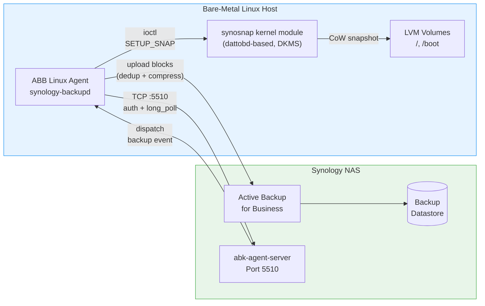

# ABB Linux Agent on Bare-Metal Debian/Ubuntu

This guide covers setting up Synology Active Backup for Business (ABB) on a bare-metal Linux host (Debian/Ubuntu) with direct network access to the Synology NAS. Unlike the Proxmox tunnel setup, this approach uses the ABB Linux Agent for full host-level backups including block-level snapshots.

## Architecture



## Prerequisites

- Debian 12+ or Ubuntu 22.04+ (bare-metal, not VM)
- Direct network connectivity to Synology NAS (no tunnel needed)
- Synology NAS with DSM 7.2+ and Active Backup for Business installed
- Root/sudo access on the Linux host
- LVM or plain partitions (ext4, btrfs, xfs supported)

## How It Works

The ABB Linux Agent (`synology-backupd`) runs as a systemd service and maintains a persistent TCP connection to the NAS agent-server on port 5510. The workflow:

1. **Agent connects** to NAS, authenticates with device UUID + token
2. **Agent long-polls** for backup events (400s timeout, reconnects automatically)
3. **NAS dispatches** backup job via long_poll response
4. **Agent creates snapshots** using `synosnap` kernel module (dattobd-based CoW snapshots)
5. **Agent reads** snapshot data, deduplicates, compresses, and uploads to NAS
6. **Agent destroys** snapshots after upload completes
7. **NAS verifies** backup integrity (mount test)

## Installation

### Step 1: Download and Install the Agent

Download the agent from your Synology NAS:

```bash
# From DSM: Active Backup for Business > Linux tab > Download agent
# Or via wget (adjust NAS IP and port):
wget "https://<NAS_IP>:5001/webapi/entry.cgi?api=SYNO.ActiveBackup.Agent&method=download&version=1&os=linux" \
  -O ABBAgent.deb --no-check-certificate

# Install
sudo dpkg -i ABBAgent.deb
```

The agent installs to `/opt/Synology/ActiveBackupforBusiness/`.

### Step 2: Install the synosnap Kernel Module (DKMS)

The agent package typically installs `synosnap` via DKMS automatically. Verify:

```bash
# Check if module is loaded
lsmod | grep synosnap

# Check DKMS status
dkms status synosnap

# If not loaded, load manually
sudo modprobe synosnap

# Verify via proc interface
cat /proc/synosnap-info
# Expected: {"version": "0.11.x", "devices": []}
```

### Step 3: Register the Agent

```bash
sudo /opt/Synology/ActiveBackupforBusiness/bin/synology-backupd \
  --register <NAS_IP> <DSM_USERNAME>
```

You will be prompted for the DSM password. After registration, the agent stores credentials in `/opt/Synology/ActiveBackupforBusiness/data/`.

### Step 4: Configure the Backup Task

In DSM:

1. **Active Backup for Business** > **Physical Server** > **Server List**
2. Your host should appear as "Online"
3. Click **Create Task**
4. Configure:
   - **Task name**: e.g., `hostname-Default`
   - **Source**: Select volumes to back up (typically `/` and `/boot`)
   - **Schedule**: e.g., Daily 03:00, weekdays only
   - **Retention**: GFS (e.g., 30 daily, 8 weekly, 6 monthly)
   - **Enable compression** and **deduplication**
5. Apply

### Step 5: Verify

```bash
# Check agent service status
sudo systemctl status synology-active-backup-business-linux-service

# Check agent log for successful authentication
sudo tail -20 /opt/Synology/ActiveBackupforBusiness/data/log/log.txt

# Look for "auth_type": 3 in responses (authenticated)
```

## Kernel 6.12+ Support (Peppershade Patch)

The stock synosnap module (based on dattobd) does **not compile on kernel 6.12+** due to API changes in the block layer (`bdev_file_open_by_path`, `submit_bio` signature changes, etc.).

### The Problem

```
# DKMS build fails with errors like:
error: implicit declaration of function 'blkdev_get_by_path'
error: 'struct bio' has no member named 'bi_disk'
error: too many arguments to function 'submit_bio'
```

Backup attempts will fail with snapshot error `fffffffffffffffe` (-2, ENOENT).

### The Solution: Peppershade Patch

The [Peppershade synosnap fork](https://github.com/Peppershade/synosnap) provides kernel 6.x compatibility patches.

```bash
# 1. Remove the stock DKMS module
sudo dkms remove synosnap/0.11.6 --all 2>/dev/null

# 2. Clone the patched source
cd /usr/src
sudo git clone https://github.com/Peppershade/synosnap.git synosnap-0.11.7

# 3. Install via DKMS
sudo dkms add synosnap/0.11.7
sudo dkms build synosnap/0.11.7
sudo dkms install synosnap/0.11.7

# 4. Reload the module
sudo systemctl stop synology-active-backup-business-linux-service
sudo rmmod synosnap
sudo modprobe synosnap
sudo systemctl start synology-active-backup-business-linux-service

# 5. Verify
cat /proc/synosnap-info
# Expected: {"version": "0.11.6", "devices": []}
# Note: MODULE_VERSION string may still show 0.11.6 (cosmetic)
dkms status synosnap
# Expected: synosnap/0.11.7, <kernel-version>, x86_64: installed
```

### Testing Snapshots

You can verify snapshot functionality directly without triggering a full backup:

```bash
cat > /tmp/test_synosnap.c << 'EOF'
#include <stdio.h>
#include <stdlib.h>
#include <fcntl.h>
#include <unistd.h>
#include <string.h>
#include <sys/ioctl.h>
#include <linux/ioctl.h>

#define DATTO_IOCTL_MAGIC 0x91
struct setup_params {
    char *bdev; char *cow;
    unsigned long fallocated_space, cache_size;
    unsigned int minor;
};
#define IOCTL_SETUP_SNAP _IOW(DATTO_IOCTL_MAGIC, 1, struct setup_params)
#define IOCTL_DESTROY    _IOW(DATTO_IOCTL_MAGIC, 4, unsigned int)
#define IOCTL_GET_FREE   _IOR(DATTO_IOCTL_MAGIC, 9, int)

int main(int argc, char *argv[]) {
    if (argc < 3) {
        printf("Usage: %s <block-device> <cow-path-on-same-fs>\n", argv[0]);
        printf("Example: %s /dev/vg/root /var/tmp/.snap_test_cow\n", argv[0]);
        return 1;
    }
    int fd = open("/dev/synosnap-ctl", O_RDONLY);
    if (fd < 0) { perror("open /dev/synosnap-ctl"); return 1; }

    int minor = -1;
    if (ioctl(fd, IOCTL_GET_FREE, &minor)) { perror("GET_FREE"); close(fd); return 1; }
    printf("Module responsive, next minor: %d\n", minor);

    FILE *f = fopen(argv[2], "w");
    if (!f) { perror("create cow"); close(fd); return 1; }
    ftruncate(fileno(f), 256*1024*1024); fclose(f);

    struct setup_params sp = { .bdev=argv[1], .cow=argv[2],
        .fallocated_space=256, .cache_size=0, .minor=(unsigned)minor };
    printf("Creating snapshot: bdev=%s cow=%s\n", argv[1], argv[2]);

    if (ioctl(fd, IOCTL_SETUP_SNAP, &sp)) {
        perror("SETUP_SNAP FAILED"); unlink(argv[2]); close(fd); return 1;
    }
    printf("SUCCESS: /dev/synosnap%d created\n", minor);

    unsigned int dm = (unsigned)minor;
    ioctl(fd, IOCTL_DESTROY, &dm);
    unlink(argv[2]);
    printf("Snapshot destroyed, cleanup done.\n");
    close(fd); return 0;
}
EOF
gcc -o /tmp/test_synosnap /tmp/test_synosnap.c
sudo /tmp/test_synosnap /dev/<VG>/<LV> /var/tmp/.snap_test_cow
```

**Important**: The COW file **must** reside on the same filesystem as the block device being snapshotted. Using `/tmp` (tmpfs) or a different mount point will fail with `EINVAL`.

## LVM Considerations

### Supported Configuration

The ABB agent works with LVM logical volumes. Each mounted LV is backed up as a separate disk image:

| Mount Point | Block Device | Backup Image |
|-------------|-------------|--------------|
| `/` | `/dev/<vg>/root` | `<vg>=root.img` |
| `/boot` | `/dev/sdX2` (or nvmeXnYpZ) | `sdX2.img` |

Unsupported filesystems (swap, EFI, unformatted) are automatically skipped.

### After LVM Layout Changes

If you modify the LVM layout (add PV, extend LV, etc.) while the synosnap module is loaded, you **must reload the module** before the next backup:

```bash
sudo systemctl stop synology-active-backup-business-linux-service
sudo rmmod synosnap
sudo modprobe synosnap
sudo systemctl start synology-active-backup-business-linux-service
```

Failure to reload after LVM changes causes snapshot error `fffffffffffffffe` (ENOENT) because the module's internal block device state is stale.

## Agent Service Management

```bash
# Service name
UNIT="synology-active-backup-business-linux-service"

# Status, start, stop, restart
sudo systemctl status $UNIT
sudo systemctl start $UNIT
sudo systemctl stop $UNIT
sudo systemctl restart $UNIT

# Agent binary and PID
cat /run/synology-backupd.pid
ps aux | grep synology-backupd

# Agent version
grep "build" /opt/Synology/ActiveBackupforBusiness/data/log/log.txt | tail -1
```

## Monitoring

### Agent Log

```bash
# Real-time monitoring
sudo tail -f /opt/Synology/ActiveBackupforBusiness/data/log/log.txt

# Key log entries to look for:
# Authentication success:
#   "auth_type": 3  (in auth response)
# Backup dispatched:
#   "check_going_to_backup" event
# Snapshot success:
#   "snapshot '/' '/dev/<vg>/root' OK"
# Snapshot failure:
#   "snapshot '/' '/dev/<vg>/root' error 'fffffffffffffffe'"
# Backup complete:
#   "status": "complete"
```

### NAS-Side Logs (via SSH)

```bash
# Agent-server log (shows job dispatch and backup processing)
ssh root@<NAS_IP> 'tail -50 /volume1/@ActiveBackup/log/agent/active-backup-agent.log'

# Activity log (human-readable backup status)
ssh root@<NAS_IP> 'tail -20 /volume1/@ActiveBackup/log/activity.log'

# Job queue log
ssh root@<NAS_IP> 'tail -20 /volume1/@ActiveBackup/log/job_queued.log'
```

### Proc Interface

```bash
# Module status and active snapshots
cat /proc/synosnap-info
# During backup: "devices" array shows active snapshot devices
# Idle: "devices" array is empty
```

## Troubleshooting

### Snapshot Error `fffffffffffffffe` (-2, ENOENT)

**Cause**: Stale module state after kernel update, LVM changes, or outdated module.

**Fix**:
1. Ensure Peppershade-patched module is installed (see above)
2. Reload module: `rmmod synosnap && modprobe synosnap`
3. Restart agent service
4. Test with the snapshot test tool

### Snapshot Error EINVAL on COW File

**Cause**: COW file is on a different filesystem than the block device.

**Fix**: The synosnap module requires the COW file to be on the **same filesystem** as the snapshotted block device. The agent handles this automatically during backup, but manual tests must place the COW file correctly.

### Agent Cannot Connect

**Symptoms**: No `auth_type` entries in log, connection timeouts.

**Check**:
```bash
# Verify NAS is reachable on port 5510
nc -zv <NAS_IP> 5510

# Check firewall
sudo iptables -L -n | grep 5510

# Check agent config
cat /opt/Synology/ActiveBackupforBusiness/data/settings/server
```

### DKMS Build Fails After Kernel Update

```bash
# Check current kernel
uname -r

# Rebuild for current kernel
sudo dkms build synosnap/0.11.7 -k $(uname -r)
sudo dkms install synosnap/0.11.7 -k $(uname -r)

# Load the rebuilt module
sudo rmmod synosnap 2>/dev/null
sudo modprobe synosnap
```

### Manual Backup Trigger (NAS-Side)

The `synoabk-jobctl backup <task_id>` command may produce jobs with `params: null` after an ABB package restart (known bug). The scheduled backup path is unaffected.

**Workaround via Unix socket** (on NAS):
```bash
# 1. Find your task_id and device_id
sqlite3 /volume1/@ActiveBackup/config.db \
  "SELECT task_id, task_name FROM task_table WHERE backup_type=3;"
sqlite3 /volume1/@ActiveBackup/config.db \
  "SELECT device_id, host_name FROM device_table;"

# 2. Create a result entry
RESULT_ID=$(sqlite3 /volume1/@ActiveBackup/activity.db \
  "INSERT INTO result_table (task_id, status, time_start, time_end) \
   VALUES (<TASK_ID>, 0, strftime('%s','now'), 0); SELECT last_insert_rowid();")

# 3. Dispatch via agent socket
python3 /var/packages/ActiveBackup/target/bin/abk_agent.py \
  /run/synoabk/abk-agent-job-cmd-socket \
  "{\"action\": \"job_queue\", \"subaction\": \"backup\", \
    \"job_id\": 99, \"params\": {\"device_id\": <DEVICE_ID>, \
    \"result_id\": $RESULT_ID}}"
```

> **Note**: This workaround sends the command to the agent-server socket directly, bypassing the broken job queue. The scheduled backup mechanism uses a different code path and works reliably.

## Key File Locations

| File | Purpose |
|------|---------|
| `/opt/Synology/ActiveBackupforBusiness/bin/synology-backupd` | Agent binary |
| `/opt/Synology/ActiveBackupforBusiness/data/log/log.txt` | Agent log |
| `/opt/Synology/ActiveBackupforBusiness/data/settings/` | Agent configuration |
| `/dev/synosnap-ctl` | Snapshot control device (char 10,260) |
| `/proc/synosnap-info` | Module status (JSON) |
| `/usr/src/synosnap-*/` | DKMS module source |
| `/run/synology-backupd.pid` | Agent PID file |

## Backup Schedule Example

```
03:00  ABB scheduled backup (Mon-Fri)
       ├── Agent receives long_poll event from NAS
       ├── Snapshot / (LVM root) + /boot (partition)
       ├── Upload changed blocks (incremental with CBT)
       ├── Destroy snapshots
       └── NAS verifies backup (mount test)
```

Typical backup duration for a ~200 GB root volume with CBT (incremental): **2-5 minutes**.
Full backup (no CBT, first run or after module reload): **15-60 minutes** depending on data volume and network speed.
